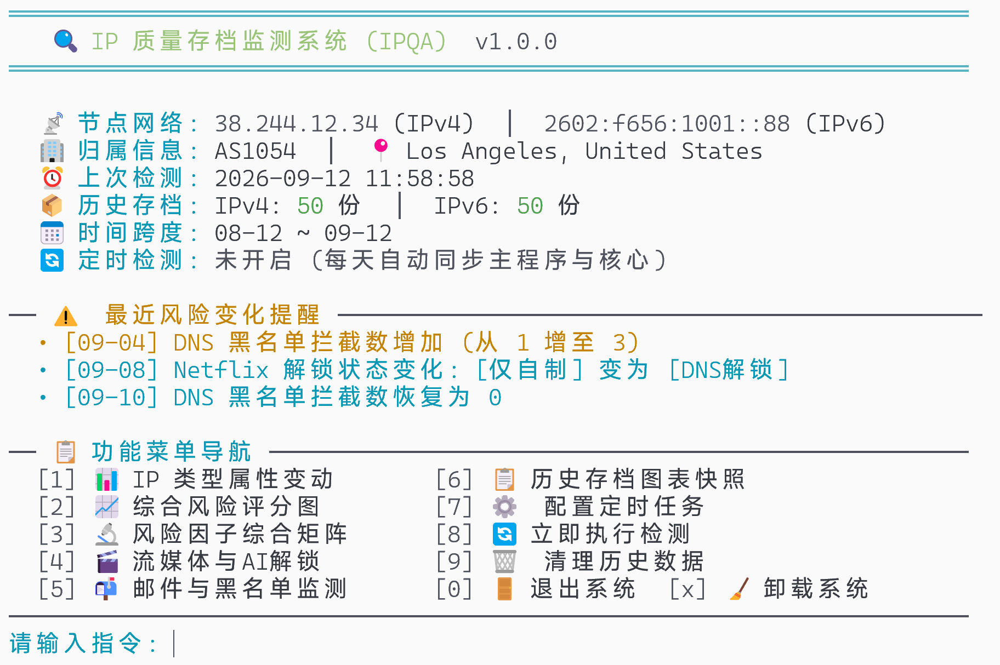
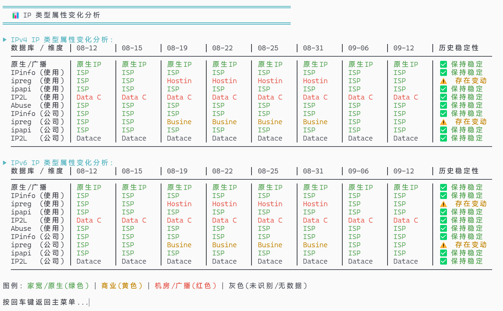
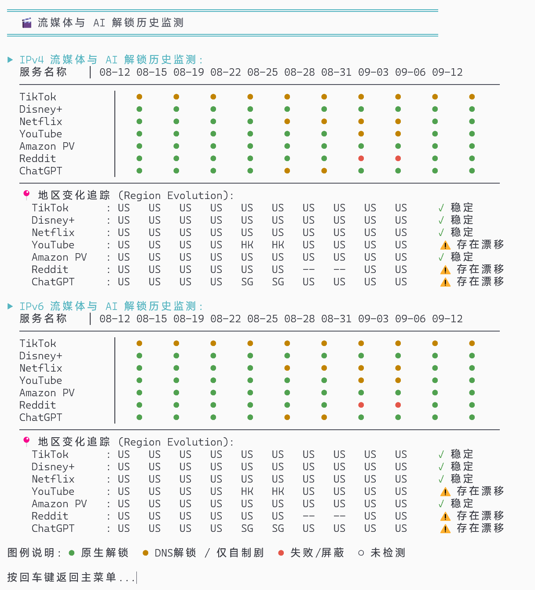
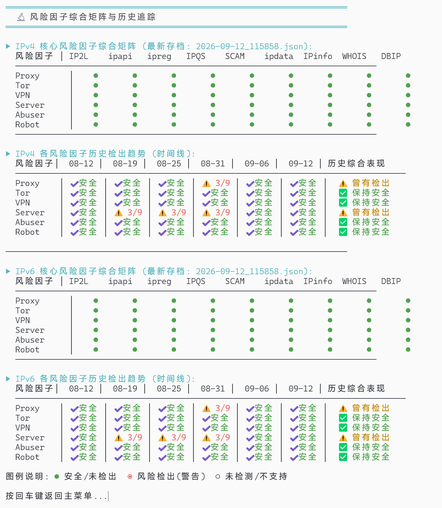
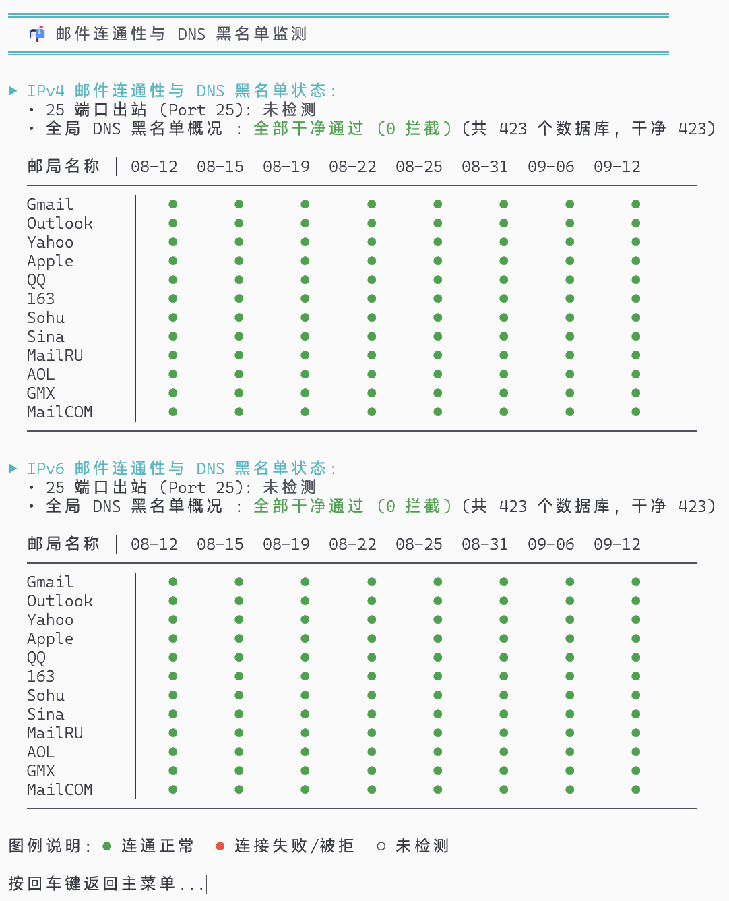
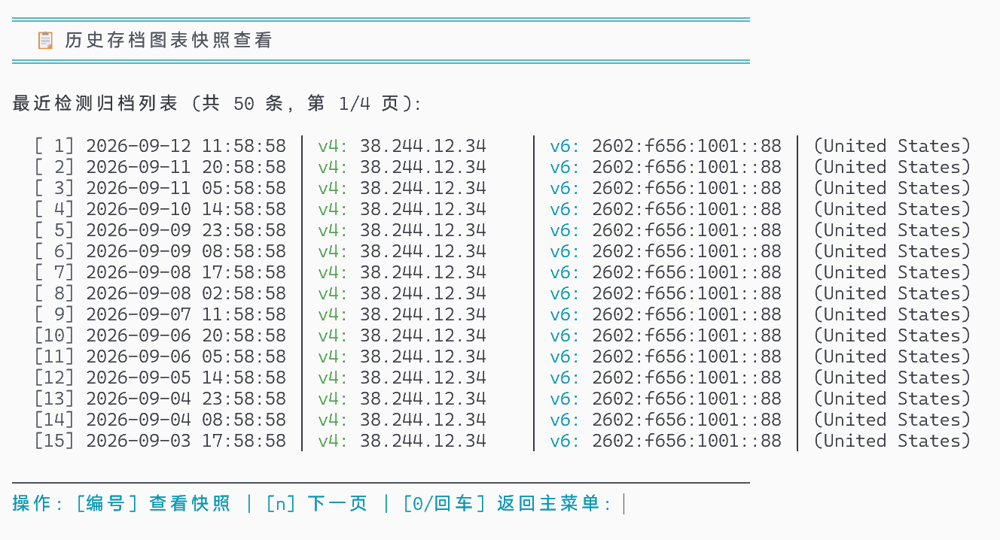
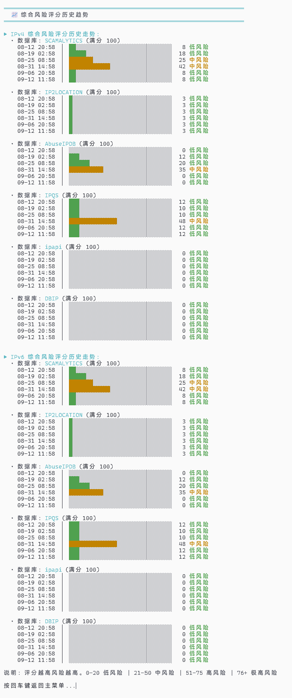
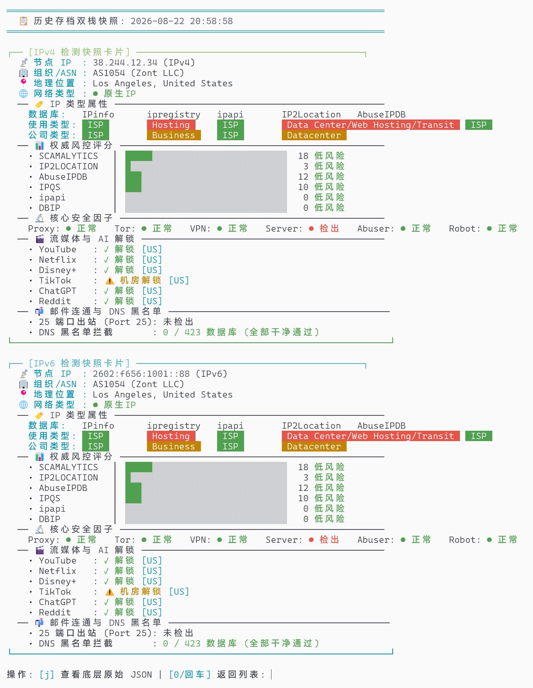

# IP Quality Archive (IPQA)

<p align="center">
  <strong>面向 Linux VPS 的 IP 质量定时归档、历史追踪与异常变动监测工具</strong>
</p>

<p align="center">
  <a href="LICENSE"></a>
  <a href="https://github.com/xykt/IPQuality"></a>
  <a href="https://github.com/Chen017/komari-plugin-ipqa-alert-report"></a>
  <a href="https://github.com/Chen017/komari-emerald-suite"></a>
</p>

基于 [IPQuality](https://github.com/xykt/IPQuality) 的 Linux IP 质量定时归档与历史监测工具。  
在保留原始 IP 质量检测能力的基础上，提供 **IPv4 / IPv6 独立归档、历史趋势、变动感知采样、风险变化摘要与异常告警记录**。

IPQA 可以完全独立使用；如果同时部署 Komari，还可通过配套插件将本地归档同步到服务器，并在 **Komari Emerald Insights** 中获得完整的图形化历史档案与集群质量视图。

---

## 系统支持 (Supported Systems)

This project targets Debian/Ubuntu based GNU/Linux systems.

Supported systems:
- **Debian** (10 / 11 / 12+)
- **Ubuntu** (20.04 / 22.04 / 24.04+)

---

## 一键安装

```bash
bash <(curl -sL https://raw.githubusercontent.com/Chen017/IP-Quality-Archive/main/install.sh)
```

安装完成后运行：

```bash
ipqa
```

即可打开终端交互菜单。

---

## 核心特性

- **双栈独立归档**  
  IPv4 / IPv6 分别定时检测并以 JSON 形式独立保存，便于长期回溯与比较。

- **历史趋势分析**  
  在终端中查看 IP 类型判定、风控评分（Scamalytics / AbuseIPDB 等）、欺诈标记，以及 Netflix、YouTube、Amazon Prime Video、AI 服务等解锁状态的历史演变。

- **变动感知采样**  
  查看长期历史时优先保留发生过属性变化的节点，减少固定抽样遗漏关键变化的问题。

- **每日风险摘要**  
  自动归纳近期风险变化，例如：
  - 风控评分明显上升
  - 流媒体掉解锁
  - 解锁地区漂移
  - DNSBL / 黑名单状态变化
  - IP 类型与关键属性变化

- **异常告警记录**  
  重要变化会写入：

  ```text
  ~/.ipqa/data/alerts.log
  ```

  可供人工查看，也可被 Komari IPQA 插件进一步汇总。

- **定时巡检**  
  根据服务器本地时区执行周期检测，支持 Crontab 静默运行。

- **检测核心更新**  
  可通过 `ipqa --update` 更新程序及上游检测核心。

---

## 工作方式

```text
                IPQuality
                   │
                   ▼
          IP Quality Archive
                   │
        ┌──────────┴──────────┐
        │                     │
        ▼                     ▼
   IPv4 JSON Archive     IPv6 JSON Archive
        │                     │
        └──────────┬──────────┘
                   │
                   ▼
           History / Diff / Alerts
                   │
                   ├──► Terminal UI
                   │
                   └──► alerts.log
```

如果接入 Komari：

```text
IP Quality Archive
        │
        │  ~/.ipqa/data/{v4,v6}
        │  ~/.ipqa/data/alerts.log
        ▼
Komari IPQA Alert Report Plugin
        │
        ├── Archive Sync
        ├── Versioned Read-only API
        ├── Semantic Change Tracking
        └── Aggregated Alerts
        │
        ▼
Komari Emerald Insights
        │
        ├── IPQA Overview
        ├── Risk Matrix
        ├── Media / AI Unlock Matrix
        └── Historical Node Archive
```

---

## 常用命令

| 命令 | 说明 |
| :--- | :--- |
| `ipqa` | 打开终端交互菜单 |
| `ipqa --check` | 立即执行一次完整检测并归档 |
| `ipqa --status` | 查看当前状态概况与近三日风险变化详情；纯文本适配远程运维，支持 `--color` |
| `ipqa --cron` | 静默执行检测，适合 Crontab 定时调用 |
| `ipqa --update` | 手动更新主程序与检测引擎 |
| `ipqa --enable-auto-update` | 启用每日自动同步更新 IPQA 脚本本身（默认开启） |
| `ipqa --disable-auto-update` | 禁用每日自动同步更新 IPQA 脚本本身（保留本地修改） |
| `ipqa --auto-update` | 查看当前 IPQA 脚本自身自动更新状态 |
| `ipqa --uninstall` | 卸载程序并清理定时任务 |

---

## 界面预览

### 主控制面板

<p align="center">
  <a href="pics/dashboard.png"></a>
  <br>
  <em>主控制面板：双栈信息、变动提醒与功能导航</em>
</p>

### 历史趋势图表

> 回看历史时自动采用变动感知采样，优先提取发生过属性变化的节点。点击图片可放大查看原图。

| IP 类型演变分析 | 流媒体与 AI 解锁历史 |
| :---: | :---: |
| <a href="pics/type_analysis.png"></a> | <a href="pics/media_unlock.png"></a> |
| **核心安全因子矩阵与追踪** | **邮件连通与 DNS 黑名单监测** |
| <a href="pics/risk_factors.png"></a> | <a href="pics/email_dnsbl.png"></a> |

### 历史存档与全量快照

<p align="center">
  <a href="pics/archive_list.png"></a>
  <br>
  <em>历史存档列表：支持 [n]/[p] 交互分页与单条快照检索</em>
</p>

| 综合风险评分历史走势（长图） | 历史双栈检测快照卡片（长图） |
| :---: | :---: |
| <a href="pics/risk_score.png"></a> | <a href="pics/snapshot_card.png"></a> |

---

## 数据目录

所有配置与数据默认保存在：

```text
~/.ipqa/
```

目录结构：

```text
~/.ipqa/
├── config.sh       # 配置文件：检测周期、保留天数、告警阈值等
├── data/
│   ├── v4/         # IPv4 历史存档：YYYY-MM-DD_HHMMSS.json
│   ├── v6/         # IPv6 历史存档
│   └── alerts.log  # 变动告警记录
└── logs/           # 运行日志
```

这些文件同时构成配套 Komari 插件的数据来源：

```text
~/.ipqa/data/v4/
~/.ipqa/data/v6/
~/.ipqa/data/alerts.log
```

因此如果需要 Komari 集成，请保留默认目录结构。

---

## Komari Emerald Ecosystem 集成

IPQA 本身不依赖 Komari，可以单独部署和使用。

如果已经使用 Komari，可以按以下方式扩展：

### 1. IPQA 数据同步与告警

安装：

[**komari-plugin-ipqa-alert-report**](https://github.com/Chen017/komari-plugin-ipqa-alert-report)

插件会：

- 增量同步 IPQA 历史归档
- 提供版本化只读 HTTP API
- 生成跨天语义差异
- 汇总风险变化
- 通过 Komari Notification 发送聚合告警

### 2. 图形化历史与集群概览

搭配：

[**Komari Emerald Insights**](https://github.com/Chen017/komari-theme-emerald-insights)

可在 Resource Insights 和节点档案中查看：

- 集群 IPQA 概览
- IPv4 / IPv6 当前状态
- 风险评分矩阵
- IP 属性变化
- 流媒体与 AI 解锁状态
- DNSBL / 邮件相关检测
- 按日期回溯的历史归档
- 语义变更时间轴
- 原始 JSON

### 3. 完整生态

完整项目关系：

```text
                         Komari
                            │
                            ▼
                Komari Emerald Insights
                            │
              ┌─────────────┴─────────────┐
              │                           │
              ▼                           ▼
   Availability History          IPQA Alert Report
                                          │
                                          ▼
                                IP Quality Archive
                                  （本项目 / VPS）
```

- [Komari Emerald Suite](https://github.com/Chen017/komari-emerald-suite)：生态聚合展示主页
- [Komari Emerald Insights](https://github.com/Chen017/komari-theme-emerald-insights)：现代化 Komari 前端主题
- [IPQA Alert Report](https://github.com/Chen017/komari-plugin-ipqa-alert-report)：IPQA 数据同步、历史 API 与告警插件
- [Availability History](https://github.com/Chen017/komari-plugin-availability-history)：基于事件账本的精确在线率插件

---

## 使用建议

### 仅需要终端 IP 质量历史

只安装：

```text
IP Quality Archive
```

即可。

### 已使用 Komari，希望集中查看 IPQA

推荐：

```text
IP Quality Archive
+
komari-plugin-ipqa-alert-report
```

### 希望获得完整可视化体验

推荐：

```text
IP Quality Archive
+
komari-plugin-ipqa-alert-report
+
Komari Emerald Insights
```

Availability History 与 IPQA 功能互相独立，不是 IPQA 的必需依赖。

---

## 更新与自动同步

### 手动全量更新

一键从 GitHub 更新 IPQA 主程序与检测核心：

```bash
ipqa --update
```

### 脚本自身自动更新管理

IPQA 默认在每日定时检测（或打开交互菜单）时，自动静默同步最新的 IPQA 管理脚本与上游检测核心。如果您希望**保留对 `ipqa.sh` 本地的修改**或在受限网络环境下避免频繁拉取 GitHub，可通过命令行随时禁用或重新开启脚本本身的自动更新（上游检测核心不受影响，仍正常每日检测更新）：

- **禁用脚本自动更新**：
  ```bash
  ipqa --disable-auto-update
  ```
- **启用脚本自动更新（恢复默认）**：
  ```bash
  ipqa --enable-auto-update
  ```
- **查看当前自动更新状态**：
  ```bash
  ipqa --auto-update
  ```
- **单次免更新执行**：
  ```bash
  ipqa --check --no-auto-update
  ipqa --cron --no-auto-update
  ```

更新不会改变已有历史归档的用途；如涉及数据结构升级，请以对应 Release / README 说明为准。

---

## 卸载

```bash
ipqa --uninstall
```

卸载前如需保留历史记录，请自行备份：

```text
~/.ipqa/data/
```

---

## Related Projects

- [IPQuality](https://github.com/xykt/IPQuality) — IP 质量检测核心
- [Komari](https://github.com/komari-monitor/komari) — 轻量服务器监控平台
- [Komari Emerald Insights](https://github.com/Chen017/komari-theme-emerald-insights) — Resource Insights 前端主题
- [Komari IPQA Alert Report](https://github.com/Chen017/komari-plugin-ipqa-alert-report) — IPQA 数据集成与告警插件
- [Komari Availability History](https://github.com/Chen017/komari-plugin-availability-history) — 精确在线率事件账本插件
- [Komari Emerald Suite](https://github.com/Chen017/komari-emerald-suite) — 配套生态总览

---

## 许可证与致谢

- 本项目采用 [AGPL-3.0](LICENSE) 协议。
- 检测核心基于 [IPQuality (xykt/IPQuality)](https://github.com/xykt/IPQuality)。
- 感谢 Komari 及相关开源项目提供的扩展与集成基础。
